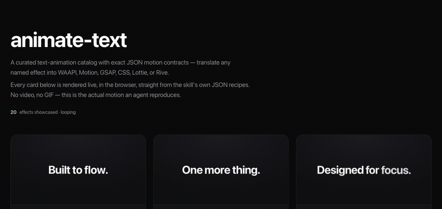
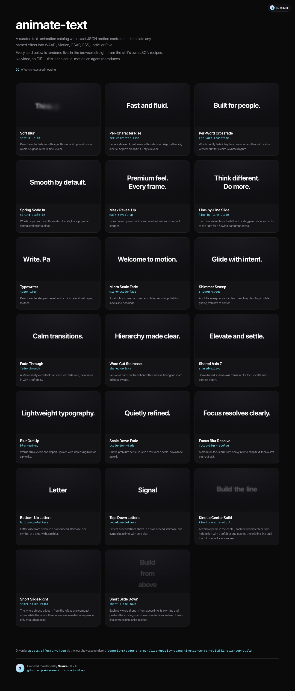

# animate-text

> A Claude / agent **skill** by [**Sakura**](https://github.com/sakuraoxo-clio) ·
> [Live demo](https://sakuraoxo-clio.github.io/sakura-animate-text/demo/) ·
> MIT licensed · contributions welcome

A curated **text-animation catalog** packaged as an agent skill. It ships exact JSON motion
contracts for headings, labels, counters, and text swaps, and tells an agent how to translate
each named effect into **WAAPI, Motion (motion.dev), GSAP, CSS, Lottie, or Rive** — without
copying the source site's typography or layout.

<p align="center">
  
</p>

> Every effect above is rendered **live in the browser, straight from this skill's own JSON
> recipes** — it is not a video. What you see is exactly the motion an agent reproduces.

## ▶ Live demo

**→ [sakuraoxo-clio.github.io/sakura-animate-text/demo](https://sakuraoxo-clio.github.io/sakura-animate-text/demo/)**

The [`demo/`](demo/) folder is a zero-dependency gallery that renders all 20 showcased effects
on a loop. Run it locally with no build step:

```bash
cd demo
python3 -m http.server 8000
# open http://localhost:8000
```

<p align="center">
  
</p>

## ▶ 喂鱼字体动效库 · live catalog

**→ [sakuraoxo-clio.github.io/sakura-animate-text/demo/catalog](https://sakuraoxo-clio.github.io/sakura-animate-text/demo/catalog/)**

Alongside the 20 curated motion contracts, the repo ships a **drop-in motion library**, a
clean-room reimplementation of common short-form text animations, every motion callable by id.

The source library carries 999 named functions — but those names are heavily padded: by
keyframe fingerprint they collapse to **52 unique motions** (234 of the names are the exact
same fade-up). The [`demo/catalog/`](demo/catalog/) gallery is therefore **de-duped to the
65 real presets** (52 motions, 13 of which also ship a looping variant), grouped into
**入场 (28) · 出场 (24) · 循环 (13)**. Each card is named for the motion it actually performs,
shows how many original names collapsed into it (`原库 ×N 同款`), and stays searchable by the
old names. Category tabs, search, a live "preview text" box, per-card copy, and
IntersectionObserver lazy-play round it out. The de-dup map lives in
[`assets/library/presets.js`](assets/library/presets.js).

Drop it into any page with no build step:

```html
<link rel="stylesheet" href="assets/library/jy-text-animations.css">
<div id="stage"></div>
<script src="assets/library/jy-text-animations.js"></script>
<script>
  // play one effect by id, on your own text
  JYTextAnimations.play("7239559299196785209", "#stage", "你的文字");
  JYTextAnimations.list("入场");                 // browse a group
  JYTextAnimations.get("7239559299196785209");  // grab the raw function
</script>
```

> These are **clean reimplementations** (keyframe contracts re-authored from scratch) — the
> library contains no third-party editor's original source. Effect names and ids are catalogued
> in [`assets/library/catalog.csv`](assets/library/catalog.csv).

## What's in the box

```
animate-text/
├── SKILL.md                 # the skill contract an agent reads
├── assets/
│   ├── specs/*.json         # 24 portable motion contracts (the authoritative intent)
│   ├── effects/*.json       # 24 exact reproduction recipes (renderer + playback + adapters)
│   ├── catalog.json         # which effects are showcased
│   ├── renderer-recipes.json
│   ├── library-adapters.json
│   ├── library/             # the drop-in motion library (喂鱼字体动效库)
│   │   ├── jy-text-animations.js   # 999 named functions + JYTextAnimations API
│   │   ├── jy-text-animations.css
│   │   ├── presets.js              # de-dup map → 65 real presets (what the gallery shows)
│   │   └── catalog.csv             # id · name · group · kind · timing index
│   └── …
├── references/              # catalog, schema, selection guide, implementation notes
├── scripts/                 # optional Node helpers (list / get / find specs)
└── demo/                    # the live visual gallery (this is what GitHub shows off)
    ├── index.html           # 20 curated motion contracts
    ├── gallery.js           # faithful JS impl of all four showcase renderers
    ├── build-data.mjs       # bundles assets/effects → effects-data.js
    ├── catalog/index.html   # 999 喂鱼字体动效库 live gallery
    └── media/               # preview.gif + catalog-grid.png
```

The skill ships **24 specs**; the gallery showcases the **20** marked visible in
[`assets/catalog.json`](assets/catalog.json).

## Effect catalog

| id | name | target | description |
|----|------|--------|-------------|
| `soft-blur-in` | Soft Blur | per-character | Per-character fade-in with a gentle blur and upward motion. Apple's signature hero-title reveal. |
| `per-character-rise` | Per-Character Rise | per-character | Letters slide up from below with no blur — crisp, deliberate, kinetic. |
| `per-word-crossfade` | Per-Word Crossfade | per-word | Words gently fade into place one after another with a short vertical drift. |
| `spring-scale-in` | Spring Scale In | per-word | Words pop in with a soft overshoot scale, like a spring settling. |
| `mask-reveal-up` | Mask Reveal Up | per-line | Lines reveal upward with a soft masked feel and compact stagger. |
| `line-by-line-slide` | Line-by-Line Slide | per-line | Each line enters from the left, exits to the right, for a flowing paragraph reveal. |
| `typewriter` | Typewriter | per-character | Per-character stepped reveal with a minimal editorial typing rhythm. |
| `micro-scale-fade` | Micro Scale Fade | whole | A calm, tiny scale pop for subtle premium polish on labels. |
| `shimmer-sweep` | Shimmer Sweep | whole | A subtle sweep across a clean headline, gliding from left to center. |
| `fade-through` | Fade Through | whole | Material-style content transition: old fades out, new fades in. |
| `shared-axis-y` | Word Cut Staircase | per-word | Per-word hard-cut transition with staircase timing for sharp swaps. |
| `shared-axis-z` | Shared Axis Z | whole | Scale-based shared-axis transition for focus shifts and depth. |
| `blur-out-up` | Blur Out Up | per-word | Words arrive clean and depart upward with increasing blur. |
| `scale-down-fade` | Scale Down Fade | whole | Restrained scale-down fade on exit for a premium settle. |
| `focus-blur-resolve` | Focus Blur Resolve | whole | A focus pull from heavy blur to crisp text, then a soft blur-out. |
| `bottom-up-letters` | Bottom-Up Letters | per-character | Letters rise from below in a pronounced staircase, zero blur. |
| `top-down-letters` | Top-Down Letters | per-character | Letters descend from above in a pronounced staircase, zero blur. |
| `kinetic-center-build` | Kinetic Center Build | per-word | Words enter right-to-left and push the line until the phrase locks centered. |
| `short-slide-right` | Short Slide Right | per-word | The phrase glides in as one move while words reveal in sequence via opacity. |
| `short-slide-down` | Short Slide Down | per-word | Words drop in from above, pushing the stack into a centered three-line lockup. |

Four more specs ship hidden (`depth-parallax-words`, `shared-axis-x`, `stagger-from-center`,
`stagger-from-edges`) and are usable by an agent even though the gallery doesn't show them.

## How an agent uses it

1. Pick an effect by id, or search by intent (`references/catalog.md`, or
   `node scripts/find-spec.mjs "<query>"`).
2. Read [`assets/specs/<id>.json`](assets/specs) for the **portable** motion contract, or
   [`assets/effects/<id>.json`](assets/effects) for the **exact** reproduction recipe
   (renderer, playback loop, timing, stage requirements, and per-library adapters).
3. Translate into the requested stack, preserving `target`, easing, stagger, and transforms.
   When a target library is named, only the matching adapter is used — no silent substitutions.

See [`SKILL.md`](SKILL.md) for the full contract.

## Regenerating the demo data

`demo/effects-data.js` is generated so the gallery works even when opened from `file://`:

```bash
node demo/build-data.mjs
```

## Author

**Sakura** — building at the intersection of AI × IP.

- GitHub: [github.com/sakuraoxo-clio](https://github.com/sakuraoxo-clio)
- This repo: [sakura-animate-text](https://github.com/sakuraoxo-clio/sakura-animate-text)

If this skill or the demo gallery is useful to you, a ⭐ on the repo is appreciated.
Issues and PRs welcome.

## License

[MIT](LICENSE) © Sakura. The demo gallery code in `demo/` is provided as-is for
showcasing the catalog; the underlying motion specs are catalogued for portable reuse.
